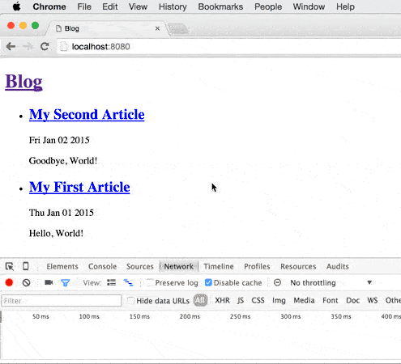

# Simple offline blog

A simple offline blog, using ServiceWorker.



## Installation

```
npm install
./node_modules/.bin/jspm install
npm run build
npm start
```

## Development workflow
```
npm run build
# OR
npm run watch
```

### Lint
```
./node_modules/.bin/eslint .
```

## Architecture
* Server renders content, client renders with enhanced content. Both renders
  share the same template (aka isomorphism or shared rendering).
* A ServiceWorker is installed on first visit. Subsequent navigation requests
  will be proxied by the ServiceWorker, which will respond with a cached shell
  (a wrapper for the content). The shell contains JavaScript which is
  responsible for fetching and rendering content.

Note that this means browsers without ServiceWorker support will just continue
to use server side rendering.

There is also a branch with shared rendering. See https://github.com/OliverJAsh/simple-offline-blog/pull/1.

## Fetch and cache rules
* Serve from cache or else network. When serving from cache, fetch the newest
  content from the network to update the content on screen and then revalidate
  the cache.
* Home page content is always cached
* Article page content is optionally cached
* The cache for shell and its subresources is versioned
